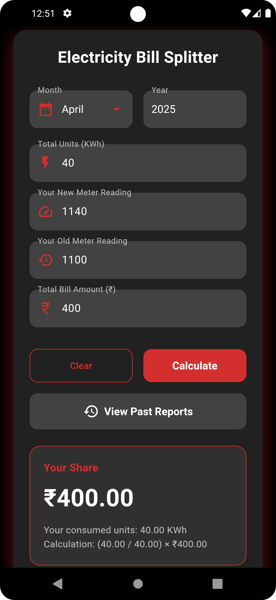
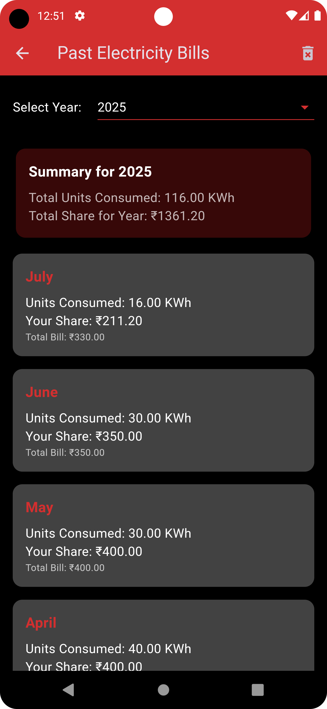

# Shared Electricity Bill Calculator

A simple and beautiful Flutter application to help roommates or family members split an electricity bill fairly based on individual meter readings. This app not only calculates the current bill but also saves historical data for yearly tracking and analysis.

## 📸 Screenshots

| Calculator Page | Past Reports Page |
| :-------------: |:-------------:|
|  |  |
---

## ✨ Features

-   **Fair Bill Splitting:** Calculates your exact share of the total bill based on the units you consumed.
-   **Historical Tracking:** Automatically saves each month's calculation to a persistent history.
-   **Annual Reports:** A dedicated "Past Reports" page to view all saved data, filterable by year.
-   **Yearly Summary:** Instantly see your total units consumed and total amount paid for any selected year.
-   **Modern UI:** A clean, responsive, and modern user interface with a dark theme.
-   **Data Persistence:** Your data is saved locally on your device using `shared_preferences`, so it's always there when you come back.
-   **Input Validation:** Robust error handling to prevent incorrect calculations (e.g., old reading > new reading).
-   **User-Friendly Inputs:** Uses dropdowns for month and year selection to minimize errors.

---

## 🚀 Getting Started

To get a local copy up and running, follow these simple steps.

### Prerequisites

-   You must have [Flutter](https://flutter.dev/docs/get-started/install) installed on your machine.

### Installation

1.  **Clone the repository:**
    ```sh
    git clone https://github.com/ravikrsna9/Electricity-Bill-Splitter.git
    ```
2.  **Navigate to the project directory:**
    ```sh
    cd Electricity-Bill-Splitter
    ```
3.  **Install dependencies:**
    ```sh
    flutter pub get
    ```
4.  **Run the app:**
    ```sh
    flutter run
    ```

---

## 🔧 Built With

This project utilizes a variety of modern tools and packages:

-   **[Flutter](https://flutter.dev/)** - The UI toolkit for building beautiful, natively compiled applications for mobile, web, and desktop from a single codebase.
-   **[Dart](https://dart.dev/)** - The programming language used.
-   **[shared_preferences](https://pub.dev/packages/shared_preferences)** - For saving key-value data persistently on the device.
-   **[intl](https://pub.dev/packages/intl)** - For date formatting (e.g., displaying month names).
-   **[url_launcher](https://pub.dev/packages/url_launcher)** - For opening external links.

---

## 📄 License

This project is licensed under the MIT License - see the [LICENSE](LICENSE) file for details.